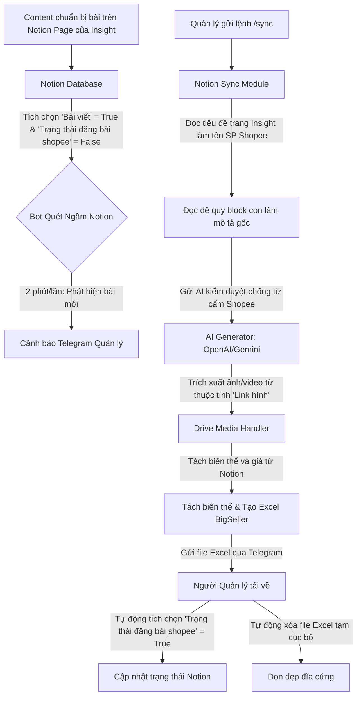

# 🤖 Hermes-Agent-Shopee (Notion to BigSeller Excel Auto Sync Bot)

Hệ thống tự động hóa đồng bộ sản phẩm từ **Notion Database** sang **BigSeller Excel** cấp độ chuyên gia. Tích hợp **Telegram Bot cảnh báo thời gian thực** và cơ chế **kiểm duyệt nội dung bằng AI** để chống vi phạm chính sách của sàn Shopee VN.

---

## 🧭 Luồng Hoạt Động Của Hệ Thống (Workflow)

Hệ thống hoạt động theo mô hình khép kín tự động hóa giữa Notion, Google Drive, AI API, BigSeller Excel và Telegram:



### 🔍 Chi tiết các bước xử lý:

1. **Quét ngầm & Cảnh báo (2 phút/lần):** 
   Một luồng phụ (daemon thread) chạy ngầm kiểm tra Notion Database định kỳ. Khi phát hiện sản phẩm có thuộc tính `Bài viết` = `True` và `Trạng thái đăng bài shopee` = `False`, bot Telegram sẽ gửi tin nhắn cảnh báo chủ động tới Chat ID của Quản lý: *"Shopee MCP Server xin thông báo: CÓ SẢN PHẨM MỚI CHỜ ĐĂNG SHOPEE!"*.
2. **Kích hoạt đồng bộ:** 
   Quản lý gửi lệnh `/sync` qua Telegram. Bot sẽ khóa trạng thái và tiến hành tải dữ liệu của các sản phẩm thỏa mãn điều kiện.
3. **Đọc bài viết đệ quy từ trang Insight con:** 
   Đối với mỗi liên kết trang con Notion trong cột `Insight Library`, hệ thống sẽ:
   * Lấy tiêu đề trang Insight làm **Tên sản phẩm Shopee** (chuẩn SEO).
   * Lấy đệ quy toàn bộ block con bên trong trang (headings, danh sách, quote, callout) để dựng thành **Mô tả sản phẩm gốc**.
4. **Kiểm duyệt bằng AI (Shopee Policy Compliance):** 
   Gửi mô tả gốc qua OpenAI (sử dụng GPT-4o-mini) để tự động kiểm duyệt và tinh chỉnh các từ ngữ dễ bị quét lỗi vi phạm ngành hàng Sức Khỏe & Sắc Đẹp của Shopee VN (ví dụ: đổi *"đặc trị"* thành *"hỗ trợ giảm"*, *"trị mụn"* thành *"chăm sóc da mụn"*, *"thuốc"* thành *"sản phẩm"*...). AI cam kết **giữ nguyên 100% định dạng markdown gốc** của bạn.
5. **Xử lý hình ảnh và video từ Drive (2 cơ chế linh hoạt):**
   * **Cơ chế 1 (Mặc định - Ưu tiên)**: Truy cập thuộc tính `Link hình` của chính trang Insight con, quét thư mục Drive tại đây để lấy ảnh/video.
   * **Cơ chế 2 (Tự động quét phân cấp)**: Nếu `Link hình` trống, bot tự động tìm trong thư mục chính của sản phẩm trên Drive, quét thư mục con có tên trùng hoặc tương tự tối thiểu 50% với tên Insight (ví dụ: Insight `Da dầu mụn` khớp với thư mục `Da dầu mụn`).
   * **Ảnh bìa & Album**: Ảnh có tên `"1"` (như `1.png`, `1.jpg`) được chọn làm ảnh bìa chính (`Ảnh bìa*`). Các ảnh còn lại tự động đẩy vào album phụ (`Hình ảnh 1` đến `Hình ảnh 8`).
   * **Nhúng Video**: Nếu phát hiện file video, bot chuyển đổi thành direct download link gán vào cột `Link nhà cung cấp`.
6. **Xử lý Biến thể & Giá:**
   * Lấy tên thuộc tính phân loại chính từ cột `Biến thể` (hỗ trợ kiểu `multi_select`, ví dụ: `"số lượng"`) gán vào cột `Tên phân loại 1`.
   * Tách các cặp biến thể con và giá từ cột `Biến thể & giá` (ngăn cách bởi dấu `|` và xuống dòng, ví dụ: `1 hộp|90.000` và `2 hộp|170.000`).
   * Tự động để trống hai cột `SKU sản phẩm` và `SKU` để BigSeller tự động sinh mã thích hợp khi upload.
7. **Dọn dẹp & Hoàn thành:** 
   Gửi file Excel trực tiếp qua Telegram, đánh dấu `Trạng thái đăng bài shopee` = `True` trên Notion và tự động xóa file Excel tạm trên ổ cứng để bảo vệ tài nguyên máy chủ.

---

## ✨ Tính Năng Nổi Bật

* **Xử lý song song cực nhanh (High Performance)**: Tích hợp cơ chế chạy đa luồng (`ThreadPoolExecutor`) gọi AI kiểm duyệt và Notion API đồng thời cho tất cả các Insight cùng lúc, giảm tổng thời gian xử lý xuống gấp 5 lần (chỉ còn khoảng ~9 giây thay vì 45 giây như trước).
* **AI Copywriter & Policy Moderator**: Tự động lọc từ cấm, tối ưu hóa nội dung mô tả giúp sản phẩm của bạn duyệt nhanh trên Shopee mà không lo bị khóa hay cảnh cáo.
* **Giữ nguyên định dạng Notion**: Bảo toàn cấu trúc định dạng markdown gốc (emoji đầu dòng, headings lớn, bullet points, callout `💡`...).
* **Ánh xạ Drive thông minh**: Tự động chuyển đổi file ảnh/video thành direct download link cho Shopee CDN load trực tiếp.
* **Để trống SKU**: Tự động hóa việc đồng bộ mà không lo trùng lặp SKU cha-con trên BigSeller.
* **Cơ chế hoạt động bền bỉ (Resiliency)**:
  * **Bot Watchdog**: Tự động khởi động lại luồng quét ngầm Notion nếu luồng bị crash đột ngột.
  * **Infinity Polling & Timeout**: Tự động kết nối lại khi mạng chập chờn.
  * **Exponential Backoff**: Tự động thử lại khi Notion API bị giới hạn request (rate limit).

---

## 🏷️ Phân Loại Danh Mục Shopee VN Thông Minh (Category Classification)

Hệ thống tích hợp bộ phân loại danh mục tự động kết hợp giữa **Quy tắc từ khóa (Rule-based)** và **AI-based (Gemini/OpenAI)** để tự động nhận diện và gán đúng **mã ID danh mục con cấp lá (leaf category ID)** của Shopee Việt Nam. Điều này giúp ngăn ngừa triệt để lỗi bắt buộc chọn lại danh mục (`-- Vui lòng chọn --`) cũng như lỗi từ chối import file Excel của BigSeller do thiếu ID danh mục bắt buộc.

### Các danh mục con cấp lá đã chuẩn hóa:
* **Thực phẩm bổ sung (Sức khỏe)**: ID `101543` (Ví dụ: `ZicumGSV` viên uống bổ sung kẽm và vitamin C).
* **Tinh chất dưỡng da / Serum (Sắc đẹp)**: ID `11035552` (Ví dụ: Các dòng serum trị mụn, phục hồi, dưỡng sáng).
* **Sữa rửa mặt (Sắc đẹp)**: ID `11035550` (Ví dụ: Gel rửa mặt, sữa rửa mặt).
* **Kem dưỡng ẩm (Sắc đẹp)**: ID `11035554` (Ví dụ: Kem dưỡng phục hồi, kem bôi da).
* **Chăm sóc da mặt chung (Sắc đẹp)**: ID `11035544` (Dùng cho các dòng kem chống nắng, tẩy trang, mặt nạ...).
* **Tắm & Chăm sóc cơ thể (Sắc đẹp)**: ID `11035609` (Dùng cho sữa tắm, dưỡng thể).
* **Chăm sóc tóc (Sắc đẹp)**: ID `11035609` (Dùng cho dầu gội, dầu xả).
* **Thiết bị y tế (Sức khỏe)**: ID `11036394` (Khẩu trang y tế, máy đo huyết áp...).
* **Mẹ & Bé**: ID `11035567` (Tã bỉm, sữa bột...).

---

## 📋 Cấu Trúc Bảng Notion (Database Schema)

### 1. Bảng chính (Database cha)
| Tên Cột | Kiểu Dữ Liệu | Vai Trò |
| :--- | :--- | :--- |
| **Tên sản phẩm** | `Title` (Mặc định) | Tên sản phẩm gốc để tìm thư mục Drive |
| **Bài viết** | `Checkbox` | Content tích chọn khi chuẩn bị xong dữ liệu |
| **Trạng thái đăng bài shopee** | `Checkbox` | Bot tích chọn `True` sau khi đã xuất Excel thành công |
| **Insight Library** | `Relation` hoặc `Rich text` | Chứa liên kết đến các trang Insight con |
| **Biến thể** | `Multi-select` hoặc `Select` | Tên thuộc tính phân loại chính (ví dụ: `số lượng`) |
| **Biến thể & giá** | `Rich text` | Định dạng biến thể và giá ngăn cách bởi `|` và xuống dòng |
| **Media sản phẩm** | `URL` | Đường link thư mục Drive cha (Fallback) |

### 2. Trang con Insight (Database con)
| Tên Thuộc Tính | Kiểu Dữ Liệu | Vai Trò |
| :--- | :--- | :--- |
| **Name** | `Title` (Mặc định) | Tiêu đề Insight -> Dùng làm **Tên sản phẩm Shopee** |
| **Link hình** | `URL` hoặc `Rich text` | Link thư mục Google Drive chứa hình ảnh/video riêng cho Insight này |
| **Nội dung trang** | `Page Content` | Các block con -> Dùng làm **Mô tả sản phẩm** |

---

## 🛠️ Yêu Cầu Hệ Thống & Cài Đặt

### 1. Yêu cầu hệ thống:
* Python 3.10 trở lên.
* Cài đặt thư viện dependencies:
  ```bash
  pip install -r requirements.txt
  ```

### 2. Thiết lập Biến môi trường (`.env`):
Tạo file `.env` tại thư mục gốc của dự án và cấu hình đầy đủ các biến sau:
```env
# Notion Credentials
NOTION_TOKEN=secret_your_notion_token_here
NOTION_DATABASE_ID=your_notion_database_page_id_here

# Telegram Bot Credentials
TELEGRAM_BOT_TOKEN=your_telegram_bot_token_here
MANAGER_CHAT_ID=your_manager_chat_id_here  # Chat ID nhận cảnh báo sản phẩm mới

# AI API Credentials (OpenAI sk- hoặc Gemini)
GEMINI_API_KEY=your_openai_or_gemini_api_key_here
```

### 3. Khởi chạy hệ thống:
```bash
python -m src.telegram_bot
```

---

## 📦 Kiến Trúc Thư Mục Dự Án

```ini
shopee-mcp-server/
├── src/
│   ├── __init__.py
│   ├── config.py             # Quản lý cấu hình & đọc biến môi trường
│   ├── telegram_bot.py       # Bot Telegram chính, điều hướng & chạy quét ngầm
│   ├── notion_sync.py        # Module xử lý dữ liệu và đồng bộ Notion
│   ├── ai_generator.py       # AI kiểm duyệt mô tả sản phẩm (Shopee Compliance)
│   ├── convert_zicum.py      # Module cào ảnh Google Drive sang direct link
│   └── notion_to_bigseller.py# Hàm phụ trợ xuất file excel cấu trúc BigSeller
├── import_template_VN.xlsx   # File template mẫu gốc của BigSeller
├── requirements.txt          # Các thư viện phụ thuộc
├── start_bot.bat             # File script chạy nhanh trên Windows
└── README.md                 # Tài liệu hướng dẫn sử dụng
```

---

## 🛡️ Bản Quyền & Giấy Phép
Dự án được phát triển nhằm phục vụ tự động hóa quy trình quản lý của hệ thống **Hermes Agent**. Nghiêm cấm chia sẻ file cấu hình `.env` chứa API Token nhạy cảm lên các kho lưu trữ công cộng.
